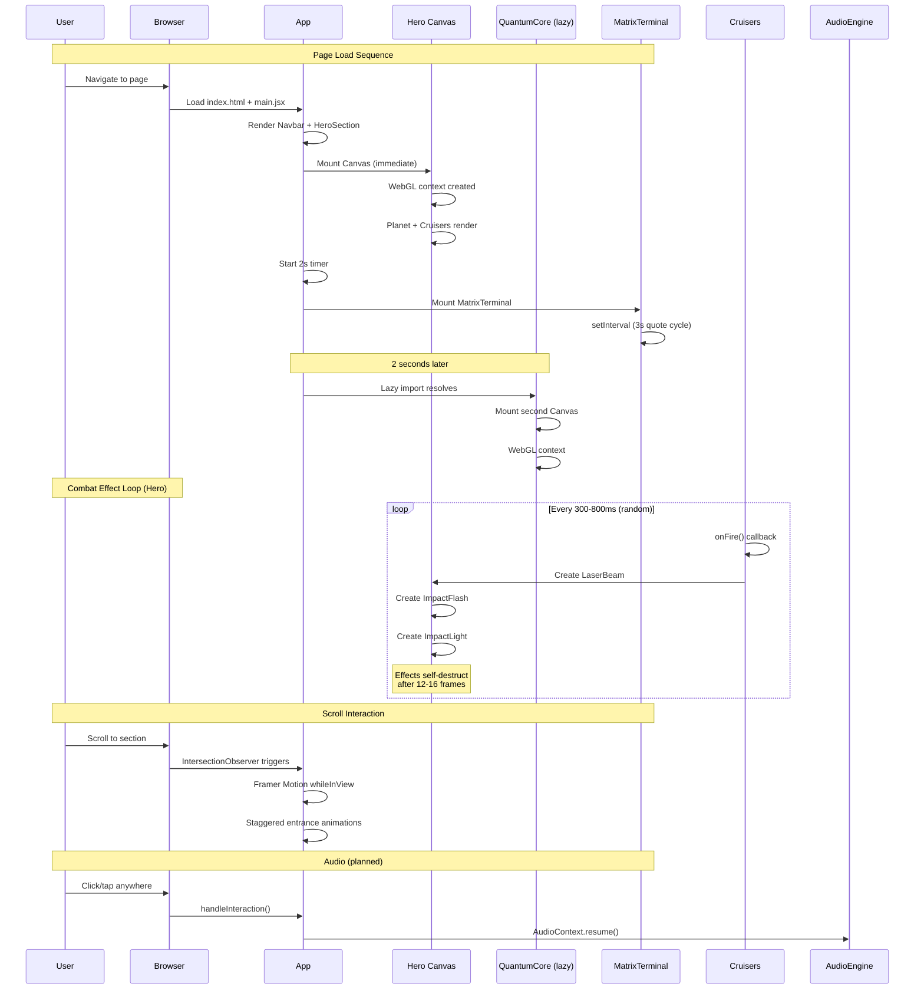
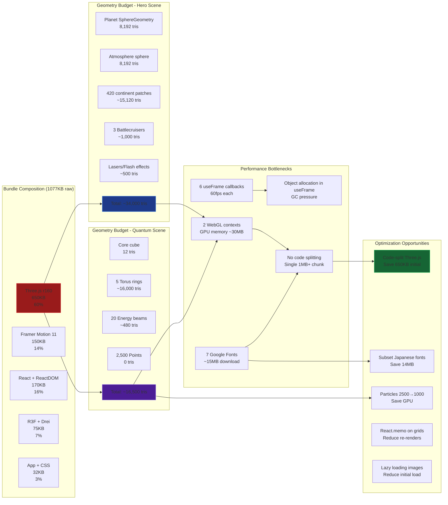

# TERRAN COMMAND — Architecture Diagrams

> Cinematic orbital AI warfare terminal themed around Terran Dominion from StarCraft.
> Built with React 18, Three.js (R3F), Framer Motion 11, and Vite 5.

---

## Diagram 1: Complete Application Architecture

```mermaid
graph TB
    subgraph "Entry Point"
        HTML[index.html<br/>Google Fonts 7 families<br/>SVG favicon]
        Main[main.jsx]
    end
    
    subgraph "Root App"
        App[App.jsx<br/>76 lines]
        CSS[App.css<br/>1067 lines]
    end
    
    subgraph "UI Components"
        Navbar[Navbar.jsx<br/>Fixed HUD navigation]
        Hero[HeroSection.jsx<br/>BOOT SEQUENCE]
        Fleet[FleetGrid.jsx<br/>DEPLOYMENT GRID]
        Cinematic[CinematicGrid.jsx<br/>TACTICAL DATABASE]
        Briefing[MissionBriefing.jsx<br/>NEURAL NETWORK]
        Terminal[MatrixTerminal.jsx<br/>Falling quotes]
        Divider[SectionDivider.jsx<br/>SYSTEMS LINK]
        Meta[SectionMeta.jsx<br/>Clearance badge]
    end
    
    subgraph "3D Systems - Hero Scene"
        HeroCanvas[Canvas<br/>R3F]
        ThreeScene[ThreeScene.jsx<br/>59 lines]
        Planet[Planet.jsx<br/>70 lines<br/>+420 continent patches]
        Cruisers[Battlecruiser.jsx ×3<br/>44 lines each<br/>Auto-fire 300-800ms]
        Effects[LaserBeam + ImpactFlash<br/>+ ImpactLight]
        Stars[Stars<br/>7000 particles]
        Camera[CameraRig.jsx<br/>Orbit 0.12 rad/s]
    end
    
    subgraph "3D Systems - Quantum Core"
        QuantumLazy[Lazy Import<br/>2s delay]
        QuantumCanvas[Canvas<br/>alpha:true]
        QuantumCore[QuantumCore.jsx<br/>134 lines]
        Rings[Torus Rings ×5<br/>radii 3.0→4.6]
        Particles[Points ×2500<br/>Cyan particles]
        Beams[EnergyBeams ×20]
        Core[MeshPhysicalMaterial<br/>transmission:1]
    end
    
    subgraph "Animation Systems"
        Framer[Framer Motion<br/>Entrance + hover]
        CSSAnim[CSS Keyframes<br/>9 animations]
        R3FAnim[useFrame<br/>60fps continuous]
    end
    
    subgraph "Audio Systems"
        AudioEngine[AudioEngine.js<br/>Web Audio API]
        Hooks[useAudioEffect.js<br/>useInViewport.js]
    end
    
    subgraph "Atmospheric Layers"
        AtmoGrid[.atmo-grid<br/>z-index 3]
        AtmoData[.atmo-data-stream<br/>z-index 3]
        AtmoFog[.atmo-fog<br/>z-index 2]
        Scanlines[.global-scanlines<br/>z-index 9998]
        Vignette[.global-vignette<br/>z-index 9997]
        Corners[.corner-*<br/>z-index 9999]
    end
    
    HTML --> Main
    Main --> App
    App --> CSS
    App --> Navbar
    App --> Hero
    App --> Fleet
    App --> Cinematic
    App --> Briefing
    App --> Terminal
    App --> Divider
    App --> Meta
    
    Hero --> HeroCanvas
    HeroCanvas --> ThreeScene
    ThreeScene --> Planet
    ThreeScene --> Cruisers
    ThreeScene --> Effects
    ThreeScene --> Stars
    ThreeScene --> Camera
    
    App --> QuantumLazy
    QuantumLazy --> QuantumCanvas
    QuantumCanvas --> QuantumCore
    QuantumCore --> Rings
    QuantumCore --> Particles
    QuantumCore --> Beams
    QuantumCore --> Core
    
    Hero --> Framer
    Fleet --> Framer
    Cinematic --> Framer
    Briefing --> Framer
    Hero --> CSSAnim
    Terminal --> CSSAnim
    Planet --> R3FAnim
    Cruisers --> R3FAnim
    QuantumCore --> R3FAnim
    
    App --> AudioEngine
    App --> Hooks
    App --> AtmoGrid
    App --> AtmoData
    App --> AtmoFog
    App --> Scanlines
    App --> Vignette
    App --> Corners
    
    style App fill:#1e3a8a,stroke:#60a5fa
    style HeroCanvas fill:#166534,stroke:#22c55e
    style QuantumCanvas fill:#854d0e,stroke:#eab308
    style AtmoGrid fill:#4c1d95,stroke:#a78bfa
```



---

## Diagram 2: 3D Scene Graph — Hero Scene

```mermaid
graph TD
    subgraph "Hero Canvas (R3F)"
        Scene[Scene]
        CameraRig[CameraRig<br/>Orbit radius 9<br/>speed 0.12 rad/s]
        Renderer[WebGLRenderer<br/>antialias:true]
    end
    
    subgraph "Lighting"
        Ambient[AmbientLight<br/>#112244 intensity 1.5]
        Directional[DirectionalLight<br/>#ffffff intensity 2<br/>position 5,3,5]
        Point[PointLight<br/>#1a9fff intensity 3<br/>position -4,2,3]
    end
    
    subgraph "Objects"
        Stars[Stars<br/>@react-three/drei<br/>7000 particles<br/>radius 200]
        Planet[Planet<br/>SphereGeometry r:2<br/>64x64 segments<br/>PhongMaterial #1155aa]
        
        subgraph "Continents (420 patches)"
            Continent1[Patch ×70<br/>SphereGeometry r:1<br/>6x6 segments<br/>Green/Brown]
            Continent2[Patch ×70<br/>...]
            ContinentN[Patch ×280<br/>...]
        end
        
        subgraph "Atmosphere"
            Outer[Outer sphere r:2.2<br/>BackSide<br/>10% cyan]
            Wireframe[Wireframe r:2.25<br/>6% opacity<br/>#88ccff]
        end
        
        subgraph "Battlecruisers"
            Lead[Lead Ship<br/>position 3.5,2.2,2<br/>scale 1.0]
            Support[Support Ship<br/>position 4.2,0.8,-1.5<br/>scale 0.55]
            Scout[Scout Ship<br/>position 5,-0.5,0.5<br/>scale 0.35]
        end
        
        subgraph "Combat Effects"
            Lasers[LaserBeam ×N<br/>CylinderGeometry<br/>Square cross-section]
            Flashes[ImpactFlash ×N<br/>SphereGeometry<br/>Expanding scale]
            Lights[ImpactLight ×N<br/>PointLight<br/>Fading intensity]
        end
    end
    
    Scene --> Ambient
    Scene --> Directional
    Scene --> Point
    Scene --> Stars
    Scene --> Planet
    Planet --> Continent1
    Planet --> Continent2
    Planet --> ContinentN
    Planet --> Outer
    Planet --> Wireframe
    Scene --> Lead
    Scene --> Support
    Scene --> Scout
    Scene --> Lasers
    Scene --> Flashes
    Scene --> Lights
    
    style Planet fill:#1e3a8a,stroke:#60a5fa
    style Lead fill:#991b1b,stroke:#ef4444
    style Lasers fill:#eab308,stroke:#fbbf24
```

---

## Diagram 3: Component Lifecycle & Data Flow



---

## Diagram 4: Z-Index Stacking Context

```mermaid
graph TB
    subgraph "Z-Index Layer 9999 (Highest)"
        TL[Corner TL<br/>40×40px bracket]
        TR[Corner TR]
        BL[Corner BL]
        BR[Corner BR]
    end
    
    subgraph "Z-Index 9998"
        GlobalScan[Global Scanlines<br/>4px repeating dark lines<br/>8% opacity]
    end
    
    subgraph "Z-Index 9997"
        Vignette[Global Vignette<br/>Radial darkening<br/>center→85% dark]
    end
    
    subgraph "Z-Index 1000"
        Navbar[Fixed Navbar<br/>backdrop-filter blur<br/>translucent bg]
    end
    
    subgraph "Z-Index 10"
        Sections[Section Content<br/>Fleet, Cinematic, Briefing<br/>SectionDivider]
    end
    
    subgraph "Z-Index 5"
        HeroContent[Hero Content<br/>Text, button, stats]
    end
    
    subgraph "Z-Index 3"
        AtmoGrid[Atmo Grid<br/>64px repeating lines<br/>3% violet opacity]
        AtmoData[Atmo Data Stream<br/>Horizontal scan sweeps]
    end
    
    subgraph "Z-Index 2"
        HeroOverlay[Hero Image Overlay<br/>battlecruiser1.jpg<br/>screen blend 18%]
        AtmoFog[Atmo Fog<br/>Dual radial gradient]
        AtmoPulse[Atmo Energy Pulse<br/>6s breathing circle]
        BodyScan[Body::before scanlines<br/>1px white 1.5%]
    end
    
    subgraph "Z-Index 1"
        HeroCanvas[Hero Canvas<br/>WebGL 3D scene]
        MatrixTerm[MatrixTerminal<br/>Falling quotes]
        HeroContentBg[Hero content container]
    end
    
    subgraph "Z-Index 0 (Base)"
        BodyBg[Body background<br/>#05010A void-black]
        BodyAfter[Body::after gradient<br/>Radial overlay]
    end
    
    TL --> GlobalScan
    GlobalScan --> Vignette
    Vignette --> Navbar
    Navbar --> Sections
    Sections --> HeroContent
    HeroContent --> AtmoGrid
    AtmoGrid --> HeroOverlay
    HeroOverlay --> HeroCanvas
    HeroCanvas --> BodyBg
    
    style TL fill:#991b1b,stroke:#ef4444
    style Navbar fill:#1e3a8a,stroke:#60a5fa
    style HeroCanvas fill:#166534,stroke:#22c55e
    style BodyBg fill:#05010a,stroke:#a1a1aa
```



---

## Diagram 5: Battlecruiser Component Architecture

```mermaid
graph LR
    subgraph "Battlecruiser Component"
        BC[Battlecruiser.jsx<br/>44 lines]
        
        subgraph "Geometry"
            Hull[BoxGeometry<br/>2.2 × 0.28 × 0.7]
            Bridge[BoxGeometry<br/>0.35³]
            Nose[ConeGeometry<br/>0.14 × 0.7, 6 segs]
            Engines[CylinderGeometry ×2<br/>0.1/0.13 × 1.1, 8 segs]
            Winglets[BoxGeometry ×2<br/>0.4 × 0.04 × 0.6]
            Antennae[CylinderGeometry ×2<br/>0.02 × 0.02 × 0.3, 4 segs]
        end
        
        subgraph "Materials"
            HullMat[MeshStandardMaterial<br/>#888899, metalness 0.8]
            BridgeMat[MeshStandardMaterial<br/>#99aacc, metalness 0.9]
            DarkMat[MeshStandardMaterial<br/>#556677, metalness 0.7]
            GlowMat[MeshBasicMaterial<br/>#4488ff]
        end
        
        subgraph "Animation (useFrame)"
            DriftX[position.x +=<br/>sin(t×0.3)×0.25]
            DriftY[position.y +=<br/>sin(t×0.5)×0.18]
            RotZ[rotation.z +=<br/>sin(t×0.2)×0.03]
            RotX[rotation.x +=<br/>sin(t×0.4)×0.04]
        end
        
        subgraph "Autonomous Behavior"
            Timer[setInterval<br/>300-800ms random]
            OnFire[onFire callback<br/>returns world position]
        end
        
        subgraph "Lighting"
            PointLight[PointLight<br/>#4488ff intensity 2<br/>distance 4]
        end
    end
    
    subgraph "ThreeScene Orchestrator"
        Positions[Positions:<br/>Lead [3.5,2.2,2]<br/>Support [4.2,0.8,-1.5]<br/>Scout [5,-0.5,0.5]]
        Scales[Scales:<br/>1.0 / 0.55 / 0.35]
        PhaseOffsets[PhaseOffsets:<br/>0 / 2 / 4]
    end
    
    Positions --> BC
    Scales --> BC
    PhaseOffsets --> BC
    BC --> Hull
    BC --> Bridge
    BC --> Nose
    BC --> Engines
    BC --> Winglets
    BC --> Antennae
    Hull --> HullMat
    Bridge --> BridgeMat
    Nose --> DarkMat
    Engines --> GlowMat
    Winglets --> HullMat
    Antennae --> DarkMat
    
    BC --> DriftX
    BC --> DriftY
    BC --> RotZ
    BC --> RotX
    BC --> Timer
    Timer --> OnFire
    BC --> PointLight
    
    style BC fill:#1e3a8a,stroke:#60a5fa,stroke-width:2px
    style HullMat fill:#854d0e,stroke:#eab308
    style PointLight fill:#eab308,stroke:#fbbf24
```

---

## Diagram 6: Quantum Core Scene Graph

```mermaid
graph TD
    subgraph "QuantumCore.jsx (134 lines)"
        QCS[QuantumCoreScene]
        
        subgraph "Fog & Environment"
            Fog[FogExp2<br/>#05010a density 0.045]
        end
        
        subgraph "Lighting"
            AmbientQ[AmbientLight<br/>#9f7bff intensity 1.2]
            CoreLight[PointLight<br/>#c084ff<br/>intensity 4-8 pulsing<br/>4Hz, distance 100]
            AccentLight[PointLight<br/>#ff2a6d intensity 3<br/>position 4,-2,4]
        end
        
        subgraph "Core Objects"
            CoreGroup[Group<br/>rotation.y += 0.002]
            
            CoreCube[Mesh<br/>BoxGeometry 4×4×4<br/>MeshPhysicalMaterial<br/>transmission:1<br/>roughness:0<br/>metalness:0.8]
            
            InnerCube[Mesh<br/>BoxGeometry 1.2³<br/>MeshBasicMaterial #ff66ff<br/>counter-rotates ±0.01]
        end
        
        subgraph "Ring System"
            Ring1[TorusGeometry r:3.0<br/>thickness 0.02<br/>16×100 segs<br/>violet]
            Ring2[TorusGeometry r:3.4<br/>crimson]
            Ring3[TorusGeometry r:3.8<br/>violet]
            Ring4[TorusGeometry r:4.2<br/>crimson]
            Ring5[TorusGeometry r:4.6<br/>violet]
        end
        
        subgraph "Particle System"
            Particles[Points<br/>2500 particles<br/>BufferGeometry<br/>80³ volume range]
            ParticleMat[PointsMaterial<br/>#7dd3fc size 0.03<br/>sizeAttenuation true]
        end
        
        subgraph "Energy Beams"
            Beams[Mesh ×20<br/>CylinderGeometry<br/>0.01×0.01×20,6 segs]
            BeamMat[MeshBasicMaterial<br/>#f97316 opacity 0.3]
        end
        
        subgraph "Helpers"
            Grid[GridHelper<br/>100×100<br/>#8b5cf6 / #222<br/>y:-5]
        end
        
        subgraph "Camera Control"
            CameraQ[Camera<br/>position 0,0,14<br/>FOV 60°]
            MouseTrack[Mouse tracking<br/>lerp factor 0.02<br/>range X ±4, Y ±3]
        end
    end
    
    QCS --> Fog
    QCS --> AmbientQ
    QCS --> CoreLight
    QCS --> AccentLight
    QCS --> CoreGroup
    
    CoreGroup --> CoreCube
    CoreGroup --> InnerCube
    CoreGroup --> Ring1
    CoreGroup --> Ring2
    CoreGroup --> Ring3
    CoreGroup --> Ring4
    CoreGroup --> Ring5
    
    QCS --> Particles
    Particles --> ParticleMat
    QCS --> Beams
    Beams --> BeamMat
    QCS --> Grid
    QCS --> CameraQ
    CameraQ --> MouseTrack
    
    style QCS fill:#1a1a1a,stroke:#c084fc,stroke-width:2px
    style CoreCube fill:#336791,stroke:#00aaff
    style Particles fill:#4db33d,stroke:#00684a
    style CoreLight fill:#eab308,stroke:#fbbf24
```



---

## Diagram 7: Animation Timing Chart

```mermaid
gantt
    title Animation Timeline (page load)
    dateFormat ss.SSS
    
    section Entrance
    Navbar slideIn (y:-60→0)    :0.000, 0.8s
    Hero meta fade + slide       :0.000, 0.6s
    Hero stats (3 items)        :0.800, 0.6s
    Hero sector status          :1.000, 0.6s
    Hero deploy button          :1.200, 0.7s
    AnimatedText REDSTAR (8 chars, staggered 0.04s each) :0.000, 0.32s
    AnimatedText DIVISION (8 chars) :0.000, 0.32s
    
    section Scroll-triggered
    Fleet h2                    :after hero, 0.6s
    Fleet p                     :after hero, 0.5s
    Fleet tile 1 (delay 0s)     :after hero, 0.5s
    Fleet tile 2 (delay 0.1s)   :after hero, 0.5s
    Fleet tile 3 (delay 0.2s)   :after hero, 0.5s
    Fleet tile 4 (delay 0.3s)   :after hero, 0.5s
    Fleet tile 5 (delay 0.4s)   :after hero, 0.5s
    Fleet tile 6 (delay 0.5s)   :after hero, 0.5s
    
    CinematicGrid tiles (stagger 0.1s) :after fleet, 0.5s
    MissionBriefing panel       :after cinematic, 0.7s
    
    section Continuous (R3F)
    Planet rotation (0.08 rad/s)    :0.000, active
    Planet bob (0.5Hz, 0.3 amplitude) :0.000, active
    Atmosphere counter-rotation (-0.02) :0.000, active
    Camera orbit (0.12 rad/s)   :0.000, active
    Cruiser drift (0.3-0.5Hz)   :0.000, active
    Laser combat (random 300-800ms) :0.000, active
    
    section Continuous (Quantum)
    Core cube rotation (0.003/rf)   :2.000, active
    Core cube breathing (2Hz)   :2.000, active
    Inner cube counter-rotation (0.01/rf) :2.000, active
    Particles drift upward       :2.000, active
    Center light pulsing (4Hz)   :2.000, active
    Mouse tracking camera        :2.000, active
    
    section CSS Continuous
    Pulse dot (1.8s cycle)       :0.000, infinite
    Cinematic flicker (4s cycle) :0.000, infinite
    Matrix terminal columns (random 10-22s) :0.000, infinite
    Data stream sweep (8s/12s)   :0.000, infinite
    Energy pulse (6s cycle)      :0.000, infinite
    Global scanlines (0.1s loop) :0.000, infinite
```

---

## Diagram 8: MatrixTerminal System

```mermaid
flowchart TB
    subgraph "MatrixTerminal.jsx (103 lines)"
        Init[Component Mount]
        Quotes[Quotes Array<br/>50 Japanese tactical phrases]
        
        Init --> Interval[setInterval<br/>250ms]
        Init --> Burst[Initial burst<br/>25 columns over 3s]
        
        subgraph "Column Creation"
            RandomPos[left: random 0-100%]
            RandomDur[duration: 10-22s]
            RandomOpacity[opacity: 0.1-0.45]
            RandomSize[font-size: 0.65-1.15rem]
            AlarmChance[15% chance .alarm class<br/>crimson color]
            
            CreateColumn[Create column div]
            AddQuotes[Add 8-20 random quotes]
            AppendDOM[Append to #matrixTerminal]
            
            RandomPos --> CreateColumn
            RandomDur --> CreateColumn
            RandomOpacity --> CreateColumn
            RandomSize --> CreateColumn
            AlarmChance --> CreateColumn
            CreateColumn --> AddQuotes
            AddQuotes --> AppendDOM
        end
        
        subgraph "Cleanup"
            setTimeout[setTimeout<br/>duration + 500ms]
            RemoveColumn[Remove column from DOM]
        end
        
        Interval --> CreateColumn
        AppendDOM --> setTimeout
        setTimeout --> RemoveColumn
    end
    
    subgraph "CSS Animation"
        MatrixFall[Keyframe: matrixFall<br/>translateY -100% → 100vh]
        ColumnStyle[.matrix-column<br/>position: fixed<br/>top: 0<br/>pointer-events: none]
        QuoteStyle[span<br/>display: block<br/>font-family: monospace]
        AlarmStyle[span.alarm<br/>color: var(--crimson)]
    end
    
    subgraph "Quote Examples"
        Q1["総員、戦闘配置<br/>(All hands, battle stations)"]
        Q2["量子炉、安定状態<br/>(Quantum reactor stable)"]
        Q3["敵性反応を確認<br/>(Hostile reaction detected)"]
        Q4["シールド最大稼働中<br/>(Shields at maximum)"]
        Q5["赤星師団、出撃準備完了<br/>(Redstar Division ready)"]
    end
    
    Quotes --> Q1
    Quotes --> Q2
    Quotes --> Q3
    Quotes --> Q4
    Quotes --> Q5
    
    CreateColumn --> ColumnStyle
    CreateColumn --> MatrixFall
    AddQuotes --> QuoteStyle
    AlarmChance --> AlarmStyle
    
    style MatrixTerminal fill:#1a1a1a,stroke:#7DD3FC,stroke-width:2px
    style Quotes fill:#854d0e,stroke:#eab308
    style AlarmStyle fill:#991b1b,stroke:#ef4444
```

---

## Diagram 9: CSS Layer & Atmospheric System

```mermaid
graph TB
    subgraph "src/App.css (1067 lines)"
        
        subgraph ":root Variables"
            Surfaces[--void-black, --obsidian<br/>--graphite, --slate]
            Accents[--lavender, --violet<br/>--plasma, --ultraviolet]
            Functional[--crimson, --warning<br/>--signal-cyan, --ion-blue<br/>--reactor-teal]
            Fonts[--font-display, --font-hud<br/>--font-pixel, --font-body<br/>--font-ui, --font-mono]
        end
        
        subgraph "Base Styles (lines 1-50)"
            Reset[*, *::before, *::after<br/>margin:0, padding:0<br/>box-sizing:border-box]
            Body[body background: var(--void-black)<br/>color: var(--text-primary)]
            BodyBefore[body::before<br/>fine scanlines<br/>soft-light blend]
            BodyAfter[body::after<br/>radial gradient overlay]
        end
        
        subgraph "Atmospheric Layers (lines 871-980)"
            AtmoGrid[.atmo-grid<br/>64px repeating grid<br/>3% violet opacity<br/>z-index 3]
            AtmoData[.atmo-data-stream<br/>horizontal scan lines<br/>8s/12s sweeps<br/>z-index 3]
            AtmoFog[.atmo-fog<br/>dual radial gradient<br/>z-index 2]
            AtmoPulse[.atmo-energy-pulse<br/>6s breathing circle<br/>z-index 2]
            GlobalScan[.global-scanlines<br/>4px repeating dark lines<br/>8% opacity<br/>z-index 9998]
            GlobalVignette[.global-vignette<br/>radial darkening<br/>center→85% dark<br/>z-index 9997]
        end
        
        subgraph "Keyframes (lines 1026-1067)"
            Pulse[pulse-dot<br/>1.8s infinite]
            LetterFade[letterFadeIn<br/>0.5s forwards]
            QuantumLoad[quantum-loading<br/>1.5s infinite]
            CinemaFlicker[cinematicFlicker<br/>4s infinite]
            DataStream[dataStream<br/>8s/12s linear infinite]
            EnergyPulse[energyPulse<br/>6s ease-in-out infinite]
            BracketIn[bracket-in<br/>0.8s forwards]
            MatrixFall[matrixFall<br/>10-22s linear infinite]
            Blink[blink<br/>1s step-end infinite]
        end
        
        subgraph "Component Styles"
            NavbarStyles[Navbar<br/>fixed, backdrop-blur<br/>z-index 1000]
            HeroStyles[Hero<br/>100vh, relative<br/>canvas z-index 1]
            FleetStyles[FleetGrid<br/>12-column CSS grid<br/>stagger entrance]
            CinemaStyles[CinematicGrid<br/>5-column → 2-col @700px<br/>flicker border]
            BriefingStyles[MissionBriefing<br/>glass panel<br/>cyan glow shadow]
            TerminalStyles[MatrixTerminal<br/>fixed bottom<br/>z-index 1]
            CornerStyles[Corner brackets<br/>40×40px<br/>z-index 9999]
        end
    end
    
    Surfaces --> Body
    Accents --> HeroStyles
    Functional --> BriefingStyles
    
    BodyBefore --> GlobalScan
    BodyAfter --> GlobalVignette
    
    AtmoGrid --> NavbarStyles
    AtmoData --> NavbarStyles
    AtmoFog --> HeroStyles
    AtmoPulse --> HeroStyles
    
    Pulse --> NavbarStyles
    LetterFade --> HeroStyles
    CinemaFlicker --> CinemaStyles
    MatrixFall --> TerminalStyles
    Blink --> BriefingStyles
    BracketIn --> CornerStyles
    
    style Surfaces fill:#1e3a8a,stroke:#60a5fa
    style AtmoGrid fill:#4c1d95,stroke:#a78bfa
    style GlobalScan fill:#991b1b,stroke:#ef4444
    style Keyframes fill:#854d0e,stroke:#eab308
```

---

## Diagram 10: Performance & Bundle Analysis


